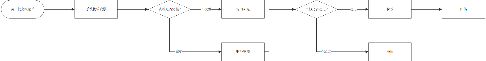
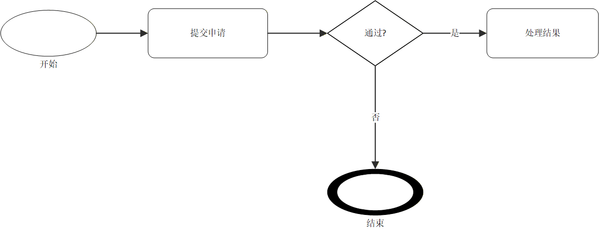
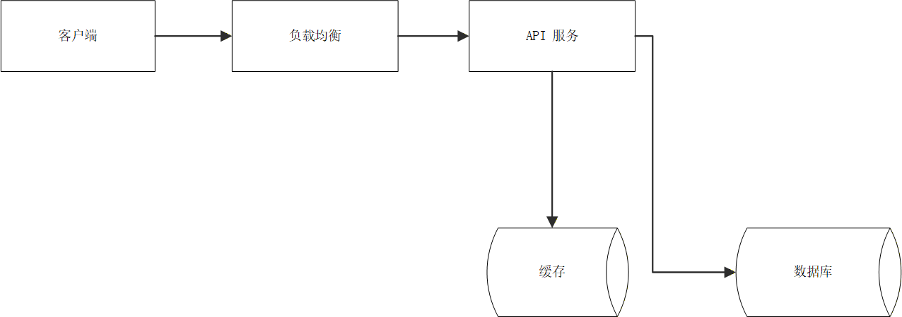
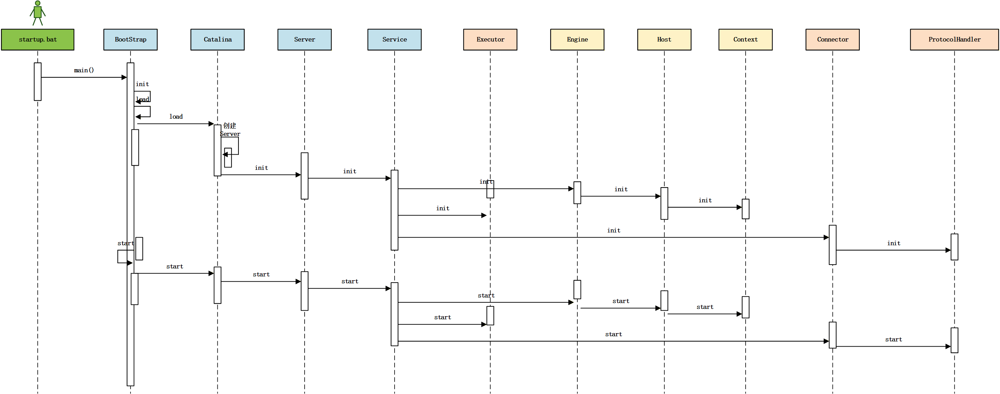

<h1 align="center">Visio Automation Skill</h1>

<p align="center">
  <strong>计算机毕设 QQ：1852568062</strong>
</p>

<p align="center">
  
  
  
  
  
</p>

这是一个让 Codex 通过 Microsoft Visio COM 直接控制 Visio 的 Skill。它不是生成一张“看起来像 Visio 的图片”，而是优先生成真正可编辑的 `.vsdx`：使用 Visio 内置 stencil/master、原生 Dynamic Connector、胶合端点和前台可见绘图。

默认情况下，Codex 会打开前台 Visio 窗口，让你看到图是怎么一步步画出来的。

## 你可以用它做什么

- 画流程图、BPMN、DFD、VSM、UML、网络图、组织结构图。
- 画普通业务流程，例如审批、报销、入职、工单、运维操作。
- 复刻截图、白板图、时序图、架构图，并尽量转成可编辑 Visio 对象。
- 把 Mermaid flowchart、draw.io 内容转成可编辑 Visio。
- 让连接线保持可编辑、可胶合、可随形状移动。
- 自动查找本机可用的 Visio master，不需要你记住 stencil 名称。
- 根据场景选择连接线策略：截图复刻更偏还原，重新设计更偏干净易读。

## 最常见的用法

你可以直接这样说：

- “用 Visio 画一个审批流程图”
- “画一个报销流程：员工提交报销单，系统校验发票，如果资料不完整就退回补充，如果完整就财务审核，审核通过后付款并归档”
- “把这张白板截图复刻成可编辑 Visio”
- “照着这张时序图画一份可编辑 Visio”
- “把这段 Mermaid 转成 Visio”
- “把这个 draw.io 文件转成可编辑 Visio”
- “帮我找一个 BPMN Gateway 对应的 Visio master”
- “把这个架构图的连接线整理一下，不要穿过节点”

## 工作方式

这个 skill 会优先：

1. 识别你要画的图属于哪一类
2. 选择 Visio 自带的合适 master
3. 用原生连接线和胶合端点连接形状
4. 保存成可编辑 `.vsdx`
5. 必要时导出预览图给你检查

## 流程示意

<div align="center">
  
</div>

## 支持的图

<div align="center">

<table>
  <thead>
    <tr>
      <th align="center">图类型</th>
      <th align="center">适合的请求</th>
    </tr>
  </thead>
  <tbody>
    <tr><td align="center">流程图</td><td>审批、报销、入职、操作流程、工单流转</td></tr>
    <tr><td align="center">BPMN</td><td>业务流程、网关、任务、事件、泳道</td></tr>
    <tr><td align="center">UML / 时序图</td><td>类图、组件图、调用链、启动流程、对象交互</td></tr>
    <tr><td align="center">网络 / 架构图</td><td>微服务、云资源、网络拓扑、系统依赖</td></tr>
    <tr><td align="center">DFD / 数据流</td><td>数据输入、处理、存储、输出</td></tr>
    <tr><td align="center">VSM</td><td>价值流、库存、生产、看板、物流</td></tr>
    <tr><td align="center">组织结构图</td><td>汇报关系、部门结构、岗位层级</td></tr>
    <tr><td align="center">截图复刻</td><td>白板、已有图、PPT 截图、手绘草图</td></tr>
  </tbody>
</table>

</div>

## 支持的输入

- 纯文字需求
- Mermaid flowchart
- raw / uncompressed draw.io XML
- 结构化截图复刻 JSON
- 图片或截图参考

## 你会得到什么

- 可编辑的 `.vsdx`
- 原生 Visio 形状和连接线
- 保持手工修改友好的布局和胶合
- 必要时的 PNG 预览

## 预览展示

这些预览都来自实际生成的 Visio 文件，原始输出仍然是可编辑 `.vsdx`。

<div align="center">

<table>
  <tr>
    <th align="center">自然语言报销流程</th>
    <th align="center">BPMN 审批流程</th>
  </tr>
  <tr>
    <td align="center"></td>
    <td align="center"></td>
  </tr>
  <tr>
    <th align="center">网络架构图</th>
    <th align="center">Tomcat 启动时序图</th>
  </tr>
  <tr>
    <td align="center"></td>
    <td align="center"></td>
  </tr>
</table>

</div>

## 连接线处理

这个 Skill 会尽量避免把连接线画成“死线”。默认会使用 Visio 原生连接线，并把端点胶合到形状上。移动节点时，连接线会跟着走。

连接线策略会根据场景变化：

- 截图复刻：尽量保留原图的直线、折线、曲线和连接位置。
- 新建图：优先选择更干净、少交叉、少绕路的路径。
- 复杂图：会尽量避开节点、文字、泳道、容器边界和已有连接线。

## 安装

### 方式一：命令安装

在终端里运行：

```powershell
npx skills add renzo1031/visio-automation-skill
```

安装完成后，你就可以直接说“用 Visio 画一个流程图”这类请求。

### 方式二：让 AI 自然语言安装

把这个仓库交给 Codex，然后直接说：

```text
请把这个 Visio Automation Skill 安装到我的 Codex skills 目录。
```

Codex 会把 `skills/visio-automation` 复制到本机 skills 目录。安装完成后，你就可以直接说“用 Visio 画一个流程图”这类请求。

### 方式三：手动安装

把 Skill 复制到 Codex 的 skills 目录即可。

```powershell
Copy-Item -Recurse -Force .\skills\visio-automation "$env:USERPROFILE\.codex\skills\visio-automation"
```

## 使用要求

- Windows
- Microsoft Visio 桌面版
- Codex 可以访问本机 Visio COM

不同 Visio 版本或语言包里的 stencil 名称可能不同。Skill 会优先搜索本机实际安装的 stencil/master，而不是只依赖固定文件名。

## 小提示

- 如果你想让图是可编辑的，不要只说“导出成图片”。
- 如果你有截图、Mermaid、draw.io 或 JSON，直接给它，skill 会尽量走原生 Visio 路径。
- 如果你希望先看着画出来，默认就是前台可见模式。
- 如果你对连接线位置有明确要求，可以直接说“从底部连到顶部”“不要绕外圈”“尽量还原截图”。

## License

This project is released under the MIT License.
